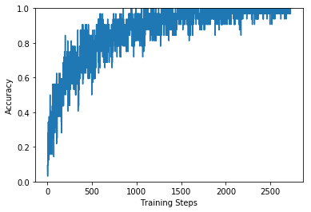

# Trabalho 1
## OCR - Optical Character Recognizer

Aluno: Bruno Flávio Ferreira - 9791330

Na primeira parte do trabalho, foi utilizada a técnica de Transfer Learning, para treinar uma rede neural capaz de reconhecer caracteres. 


```python
from __future__ import absolute_import, division, print_function, unicode_literals
import matplotlib.pylab as plt
import tensorflow as tf
import scipy.io as io
import tensorflow_hub as hub
from shutil import copyfile
from tensorflow.keras import layers
import pandas as pd
import PIL.Image as Image
import os
import numpy as np

```

Primeiro, carregamos o dataset Chars74K, 75% é carregado como dataset de treinamento, 25% como validação


```python
IMAGE_SHAPE = (224, 224)
dataset_folder = './TrainSet'
image_generator = tf.keras.preprocessing.image.ImageDataGenerator(rescale=1/255, validation_split=0.25)
image_data = image_generator.flow_from_directory(dataset_folder, target_size=IMAGE_SHAPE, subset='training')
image_validation = image_generator.flow_from_directory(dataset_folder  , target_size=IMAGE_SHAPE, subset='validation')
```

    Found 5806 images belonging to 62 classes.
    Found 1899 images belonging to 62 classes.


A Rede que será utilizada para o Transfer Learning é a Inception V3 da Google.

Primeiramente, foi carregado o Inception V3 e executado sobre algumas imagens do dataset para vermos as predições antes de realizarmos a técnica do Transfer Learning


```python
classifier_url ="https://tfhub.dev/google/tf2-preview/inception_v3/classification/4" #@param {type:"string"}
labels_path = tf.keras.utils.get_file('ImageNetLabels.txt','https://storage.googleapis.com/download.tensorflow.org/data/ImageNetLabels.txt')
imagenet_labels = np.array(open(labels_path).read().splitlines())
```


```python
classifier = tf.keras.Sequential([
    hub.KerasLayer(classifier_url, input_shape=IMAGE_SHAPE+(3,))
])

for image_batch, label_batch in image_data:
  print("Image batch shape: ", image_batch.shape)
  print("Label batch shape: ", label_batch.shape)
  break

result_batch = classifier.predict(image_batch)
print(result_batch.shape)

predicted_class_names = imagenet_labels[np.argmax(result_batch, axis=-1)]

plt.figure(figsize=(10,9))
plt.subplots_adjust(hspace=0.5)
for n in range(30):
  plt.subplot(6,5,n+1)
  plt.imshow(image_batch[n])
  plt.title(predicted_class_names[n])
  plt.axis('off')
_ = plt.suptitle("ImageNet predictions")

plt.show()
```

    WARNING:tensorflow:From /usr/local/lib/python3.6/dist-packages/tensorflow_core/python/ops/resource_variable_ops.py:1781: calling BaseResourceVariable.__init__ (from tensorflow.python.ops.resource_variable_ops) with constraint is deprecated and will be removed in a future version.
    Instructions for updating:
    If using Keras pass *_constraint arguments to layers.


    WARNING:tensorflow:From /usr/local/lib/python3.6/dist-packages/tensorflow_core/python/ops/resource_variable_ops.py:1781: calling BaseResourceVariable.__init__ (from tensorflow.python.ops.resource_variable_ops) with constraint is deprecated and will be removed in a future version.
    Instructions for updating:
    If using Keras pass *_constraint arguments to layers.


    Image batch shape:  (32, 224, 224, 3)
    Label batch shape:  (32, 62)
    (32, 1001)


Agora, carregamos uma versão do Inception V3 sem a camada final de predição, para podermos treinar no novo dataset e obtermos a classificação desejada


```python
feature_extractor_url = "https://tfhub.dev/google/tf2-preview/inception_v3/feature_vector/4" #@param {type:"string"}
feature_extractor_layer = hub.KerasLayer(feature_extractor_url,
                                         input_shape=(224,224,3))
feature_batch = feature_extractor_layer(image_batch)
print(feature_batch.shape)
feature_extractor_layer.trainable = False
model = tf.keras.Sequential([
  feature_extractor_layer,
  layers.Dense(image_data.num_classes, activation='softmax')
])
model.summary()

```

    (32, 2048)
    Model: "sequential_1"
    _________________________________________________________________
    Layer (type)                 Output Shape              Param #   
    =================================================================
    keras_layer_1 (KerasLayer)   (None, 2048)              21802784  
    _________________________________________________________________
    dense (Dense)                (None, 62)                127038    
    =================================================================
    Total params: 21,929,822
    Trainable params: 127,038
    Non-trainable params: 21,802,784
    _________________________________________________________________


Agora, nós treinamos o modelo com o dataset Chars74K


```python
predictions = model(image_batch)
model.compile(
  optimizer=tf.keras.optimizers.Adam(),
  loss='categorical_crossentropy',
  metrics=['acc'])

class CollectBatchStats(tf.keras.callbacks.Callback):
  def __init__(self):
    self.batch_losses = []
    self.batch_acc = []

  def on_train_batch_end(self, batch, logs=None):
    self.batch_losses.append(logs['loss'])
    self.batch_acc.append(logs['acc'])
    self.model.reset_metrics()

steps_per_epoch = np.ceil(image_data.samples/image_data.batch_size)

batch_stats_callback = CollectBatchStats()

history = model.fit_generator(image_data, epochs=15,
                              steps_per_epoch=steps_per_epoch,
                              validation_data=image_validation,
                              callbacks = [batch_stats_callback])

```

    Epoch 1/15
    181/182 [============================>.] - ETA: 0s - loss: 2.5959 - acc: 0.4688Epoch 1/15
    182/182 [==============================] - 49s 267ms/step - loss: 2.5911 - acc: 0.5312 - val_loss: 2.2123 - val_acc: 0.4381
    Epoch 2/15
    181/182 [============================>.] - ETA: 0s - loss: 1.4060 - acc: 0.7500Epoch 1/15
    182/182 [==============================] - 41s 224ms/step - loss: 1.4067 - acc: 0.5938 - val_loss: 1.9365 - val_acc: 0.4913
    Epoch 3/15
    181/182 [============================>.] - ETA: 0s - loss: 1.0001 - acc: 0.7188Epoch 1/15
    182/182 [==============================] - 41s 224ms/step - loss: 0.9982 - acc: 0.8750 - val_loss: 1.9483 - val_acc: 0.5092
    Epoch 4/15
    181/182 [============================>.] - ETA: 0s - loss: 0.7823 - acc: 0.8750Epoch 1/15
    182/182 [==============================] - 41s 225ms/step - loss: 0.7820 - acc: 0.8125 - val_loss: 1.8243 - val_acc: 0.5208
    Epoch 5/15
    181/182 [============================>.] - ETA: 0s - loss: 0.6067 - acc: 0.8750Epoch 1/15
    182/182 [==============================] - 41s 224ms/step - loss: 0.6066 - acc: 0.8750 - val_loss: 1.8789 - val_acc: 0.5229
    Epoch 6/15
    181/182 [============================>.] - ETA: 0s - loss: 0.4995 - acc: 0.8750Epoch 1/15
    182/182 [==============================] - 41s 224ms/step - loss: 0.4986 - acc: 0.9375 - val_loss: 1.8488 - val_acc: 0.5382
    Epoch 7/15
    181/182 [============================>.] - ETA: 0s - loss: 0.4053 - acc: 0.9062Epoch 1/15
    182/182 [==============================] - 41s 223ms/step - loss: 0.4050 - acc: 0.9688 - val_loss: 1.8393 - val_acc: 0.5371
    Epoch 8/15
    181/182 [============================>.] - ETA: 0s - loss: 0.3376 - acc: 0.8438Epoch 1/15
    182/182 [==============================] - 41s 223ms/step - loss: 0.3373 - acc: 0.9375 - val_loss: 1.9021 - val_acc: 0.5282
    Epoch 9/15
    181/182 [============================>.] - ETA: 0s - loss: 0.2800 - acc: 0.8750Epoch 1/15
    182/182 [==============================] - 41s 223ms/step - loss: 0.2804 - acc: 0.9375 - val_loss: 1.8313 - val_acc: 0.5524
    Epoch 10/15
    181/182 [============================>.] - ETA: 0s - loss: 0.2406 - acc: 1.0000Epoch 1/15
    182/182 [==============================] - 41s 224ms/step - loss: 0.2410 - acc: 0.9688 - val_loss: 1.9058 - val_acc: 0.5387
    Epoch 11/15
    181/182 [============================>.] - ETA: 0s - loss: 0.2062 - acc: 0.9688Epoch 1/15
    182/182 [==============================] - 41s 223ms/step - loss: 0.2061 - acc: 0.9688 - val_loss: 1.8948 - val_acc: 0.5308
    Epoch 12/15
    181/182 [============================>.] - ETA: 0s - loss: 0.1793 - acc: 0.9688Epoch 1/15
    182/182 [==============================] - 41s 224ms/step - loss: 0.1791 - acc: 1.0000 - val_loss: 1.8999 - val_acc: 0.5461
    Epoch 13/15
    181/182 [============================>.] - ETA: 0s - loss: 0.1550 - acc: 1.0000Epoch 1/15
    182/182 [==============================] - 41s 224ms/step - loss: 0.1549 - acc: 1.0000 - val_loss: 1.9392 - val_acc: 0.5366
    Epoch 14/15
    181/182 [============================>.] - ETA: 0s - loss: 0.1330 - acc: 1.0000Epoch 1/15
    182/182 [==============================] - 41s 224ms/step - loss: 0.1330 - acc: 1.0000 - val_loss: 1.9393 - val_acc: 0.5498
    Epoch 15/15
    181/182 [============================>.] - ETA: 0s - loss: 0.1171 - acc: 1.0000Epoch 1/15
    182/182 [==============================] - 41s 224ms/step - loss: 0.1178 - acc: 0.9688 - val_loss: 1.9435 - val_acc: 0.5461


Com o modelo treinado, podemos visualizar os gráficos de como as medidas de Loss e Accuracy se modificaram com os passos do treinamento


```python
plt.figure()
plt.ylabel("Loss")
plt.xlabel("Training Steps")
plt.ylim([0,2])
plt.plot(batch_stats_callback.batch_losses)

plt.figure()
plt.ylabel("Accuracy")
plt.xlabel("Training Steps")
plt.ylim([0,1])
plt.plot(batch_stats_callback.batch_acc)

```


    [<matplotlib.lines.Line2D at 0x7f0c771b3f28>]





Após todos os passos completos, podemos executar a predição sobre as mesmas imagens que foram classificadas pelo ImageNet anteriormente e vermos os resultados:


```python
class_names = sorted(image_data.class_indices.items(), key=lambda pair:pair[1])
class_names = np.array([key.title() for key, value in class_names])
class_names
predicted_batch = model.predict(image_batch)
predicted_id = np.argmax(predicted_batch, axis=-1)
predicted_label_batch = class_names[predicted_id]
label_id = np.argmax(label_batch, axis=-1)

plt.figure(figsize=(10,9))
plt.subplots_adjust(hspace=0.5)
for n in range(30):
  plt.subplot(6,5,n+1)
  plt.imshow(image_batch[n])
  color = "green" if predicted_id[n] == label_id[n] else "red"
  plt.title(predicted_label_batch[n].title(), color=color)
  plt.axis('off')
_ = plt.suptitle("Model predictions (green: correct, red: incorrect)")
```


Também, podemos executar a predição em imagens do dataset de validação:


```python
for validation_batch, label_batch in image_validation:
  print("Validation batch shape: ", validation_batch.shape)
  print("Label batch shape: ", label_batch.shape)
  break  

predicted_batch = model.predict(validation_batch)
predicted_id = np.argmax(predicted_batch, axis=-1)
predicted_label_batch = class_names[predicted_id]
label_id = np.argmax(label_batch, axis=-1)

plt.figure(figsize=(10,9))
plt.subplots_adjust(hspace=0.5)
for n in range(30):
  plt.subplot(6,5,n+1)
  plt.imshow(validation_batch[n])
  color = "green" if predicted_id[n] == label_id[n] else "red"
  plt.title(predicted_label_batch[n].title(), color=color)
  plt.axis('off')
_ = plt.suptitle("Model predictions - validation set (green: correct, red: incorrect)")


```

    Validation batch shape:  (32, 224, 224, 3)
    Label batch shape:  (32, 62)


